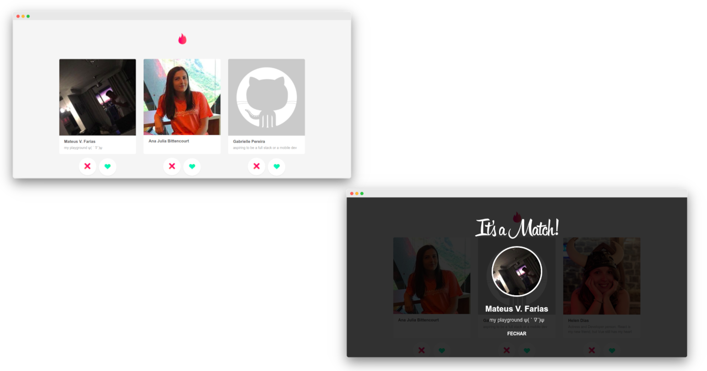

<p align="center">
  
</p>

<p align="center">
  

  

  <a href="https://github.com/fariasmateuss/tindev/issues">
    
  </a>

  
</p>

<p align="center">
  App Tinder clone!
</p> 



## Tech

- [NodeJs](https://nodejs.org/en/) - Build the server.
- [ReactJs](https://reactjs.org) - A JavaScript library for building user interfaces.
- [React Native](https://reactnative.dev) - Native Development
- [MongoDB](https://www.mongodb.com/) - NoSQL Cluster

### Preview

[Watch the video](https://youtu.be/CMpfswpfDR0)

## Development setup

### Prerequisites

To run this project in the development mode, you'll need to have a basic environment with NodeJs and React Native installed.

#### Cloning the Repository

```
  git clone https://github.com/fariasmateuss/tindev.git
```

#### Back-End

In the backend folder;

```
  yarn 
```

To start the server;

```
  yarn dev
```

#### Front-End 

In the frontend folder;

```
  yarn 
```

To up the project;

``` 
  yarn start
```

#### Mobile 

Run `yarn` in the `mobile` folder;

```
  yarn 
```

*Update the baseURL at src/services/api.js*;

To start the mobile app.

```
  react-native run-ios
```

*or*

```
  react-native run-android
```

## Contribution

See the [contribution guide](CONTRIBUTING.md) for more details on how to contribute to this project.

# License

[MIT License](/LICENSE)